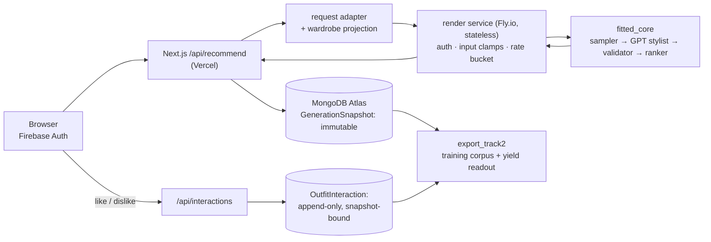

# Fitted

**A recommendation-systems dive: when does a tiny specialized model beat a per-edge LLM call?**

Fitted is an outfit recommender that turns a scattered closet into wearable outfits. It began as a
UCSB CS 148 team project; **this repository is [Brian Li](https://github.com/Brian-W-Li)'s solo
continuation**, focused on rebuilding the recommendation engine (`ml-system/`) into a v2 substrate and
using it as the seam for a trained style-graph scorer. The goal here is **technical depth**, not launch.

> **Two different things share the name "Fitted" — don't conflate them:**
> - The **team's deployed app** at [fitted-outfits.vercel.app](https://fitted-outfits.vercel.app/) runs
>   the *team's* repo (the original CS 148 product).
> - **This fork** is the engine rewrite — and since **2026-07-16 it runs its own live deployment**
>   ([fitted-three.vercel.app](https://fitted-three.vercel.app) → a stateless Python render service on
>   Fly.io), currently serving a small friends-only data-collection cohort. The M5 cutover is done: the
>   legacy recommender is deleted and every live recommendation is produced by this engine.

---

## The headline: the H26 compatibility spike

The technical centerpiece is a **pre-registered, offline systems experiment** answering a real
engineering question: the production stylist is a per-item LLM call (`gpt-5.4-mini`), which is expensive,
non-deterministic, and unavailable per-edge at closet scale. **Could a tiny specialized compatibility
model replace it — reaching the same quality at a fraction of the cost, deterministically, per-edge?**

The experiment was run as a discipline exercise: hypotheses and gates **frozen before any comparison**
(`preregistration.md`/`.json`), every frozen input **sha-256 hash-bound**, and a conjunctive go/no-go
(gates **A ∧ B ∧ D**) computed mechanically rather than argued in prose.

**Verdict: NO-GO by the frozen letter — and that ships as a complete result, not a failure.** The miss is
a *statistical-power* miss, not an accuracy miss:

- **Gate B (the blocker):** the parity CI's half-width (0.050302) exceeds the pre-registered δ (0.05) by
  **+3.02e-4** at the frozen N=500 judged-question cap — a cost cap, not a data limit. The CI sits
  *wholly above* the threshold; every point estimate favors the trained head.
- **Gate A passes:** the trained head adds **+0.0995 pair-AUC** [+0.097, +0.102] over its own zero-shot backbone.
- **Gate D passes:** **0.845 outfit AUC / 62.1% FITB** vs the honest disjoint-split floors 0.81 / 0.50.
- **Bonus finding:** an in-spike ablation independently **falsified the item-level seam shape** (+0.216,
  Holm p < 2/B), corroborating the pairwise/edge architecture the design had bet on — on the project's own data.

The headline artifact is the **systems table** (cost / determinism / availability): a trained prior scores a
200-item closet's ~19,900 edges in ~0.33 s of CPU, deterministically; the per-edge LLM equivalent is
~$82 and ~24 h sequential — and the LLM judge flips its verdict on **35.6%** of pairs when the same two
items are shown in reversed order (position bias), so it has no stable per-edge signal to build a graph on.
That trade-off — not a quality leaderboard — is the decision the experiment settles.

📄 **Read the full verdict:** [`ml-system/experiments/h26/results.md`](ml-system/experiments/h26/results.md)
(systems table, all frozen disclosures, the catalog→closet transfer caveat, and the identified levers to re-open the question).

---

## The vision it serves

The north-star is a **lens-first personal style graph**: turning a closet into a graph where owned clothes
reveal wearable connections to each other — the *"green-shirt problem"* (you own a green shirt but never
see what it goes with, so you wear the same five things). The built engine embodies the **[NOW]** rung of
this — a closet-grounded stylist with an orphan-item *rescue* vertical (pin a neglected item, find the
outfits that make it work). The *learned* graph is the staged payoff the H26 spike was probing.

**Honest status:** at this stage the style-graph is the product *framing*, not a running learned mechanism,
and the personalization/taste-learning arm is **designed, not yet demonstrated** (a zero-user fork). The
canonical, build-tagged design lives in [`docs/Fitted_Spec_v2.md`](docs/Fitted_Spec_v2.md).

---

## The live system

Since 2026-07-16 the engine serves real renders end-to-end. The Next.js app holds no OpenAI key; the
stylist call, output-schema enforcement, and spend envelope live service-side. Every render persists an
immutable `GenerationSnapshot` (full generator provenance + the item features the engine actually saw),
and every like/dislike binds to `{snapshotId, candidateId}` — the append-only training corpus the M6
scorer will train on. Deleting an account erases everything (wardrobe, photos, snapshots, feedback) —
verified live, not asserted.



---

## What's actually built

| Layer | State | What |
|---|---|---|
| `ml-system/fitted_core/` (M0–M3) | ✅ built, tested | Deterministic sampler → GPT-response validator → ranker (additive scoring, diversity, fallback ladder, bit-exact tie-breaks). Pure-function contracts. |
| Spearhead rescue vertical | ✅ built, tested | Orphan-item rescue end-to-end: forced-item pin → sufficiency check → generate → parse → validate → rank → cold-start `compatibility`/`visibility` → `optionPath`/`risk` bucketing. |
| M4 data + snapshot layer | ✅ built (snapshot substrate ships dormant) | 5-value `clothingType`, keyword-derived `warmth`, the immutable `GenerationSnapshot` training-truth record + a three-way TS↔Python↔Mongo contract. |
| H26 compatibility spike | ✅ done (NO-GO by the frozen letter) | The offline go/no-go above. |
| M5 live cutover | ✅ done, **deployed 2026-07-16** | Orchestrator, reducer seam, stateless Fly render service, regenerate vertical, live Mongo snapshot/feedback writes, §6.5 UI, trust-boundary auth — legacy recommender deleted; the engine is the only recommender. |
| Track 2 data collection | 🔄 live now | Friend-closet corpus through the real pipeline (photos + accepted/rejected labels bound to immutable snapshots) — the input the M6 re-measure is gated on. Account deletion fully erases (proven live: a deleted user exports zero). |

**Test rigor** (floors that grow, never shrink): **1097** `ml-system` pytest · **305 (+1 skip)** H26 pytest ·
**784** Next/jest. Pure-engine determinism is verified under controlled generator inputs; live GPT renders
remain stochastic by design. Gate boundaries are mutation-tested.

**Repo layout:**

| Path | What |
|---|---|
| `ml-system/fitted_core/` | The v2 substrate — the current focus. |
| `ml-system/experiments/h26/` | The compatibility spike (frozen artifacts + `results.md`). |
| `fitted/` | The Next.js 16 / React 19 app — this fork's live deployment (Vercel). |
| `docs/Fitted_Spec_v2.md` | The single canonical spec (build-ladder tagged; §23 = open-holes register). |
| `ml-system/outfit_recommender.py` | Legacy rule-based demo — runnable reference only, retired at M6. |

---

## Run it

**The `fitted_core` substrate + tests** (hermetic, no network, no API keys):

```sh
cd ml-system
python3 -m venv .venv && source .venv/bin/activate
pip install -r requirements.txt
python3 -m pytest tests -q          # the v2 substrate suite
python3 outfit_recommender.py       # the legacy rule-based demo
```

**The Next.js app** (needs Firebase + MongoDB env; the OpenAI key lives service-side, never in the app):

```sh
cd fitted
npm install
cp .env.sample .env.local           # fill in real values
npm run dev                         # http://localhost:3000
npm test
```

Stack: Next.js 16, React 19, Tailwind 4, TypeScript, MongoDB (Mongoose), Firebase Auth, OpenAI; Python 3 for `fitted_core`.

---

## Provenance & license

Originally a **UCSB CS 148 (W26)** team project — team repo
[`ucsb-cs148-w26/pj12-outfit-recommender`](https://github.com/ucsb-cs148-w26/pj12-outfit-recommender),
tracked here as the `upstream` remote. Brian was on the original team; this fork is his solo continuation of
the ML/engine work. The git history preserves all original contributors. Licensed **MIT**.
